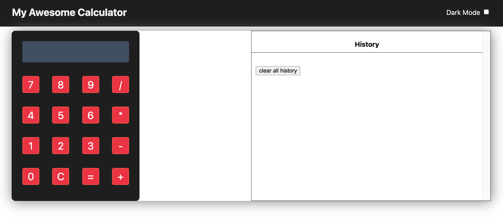
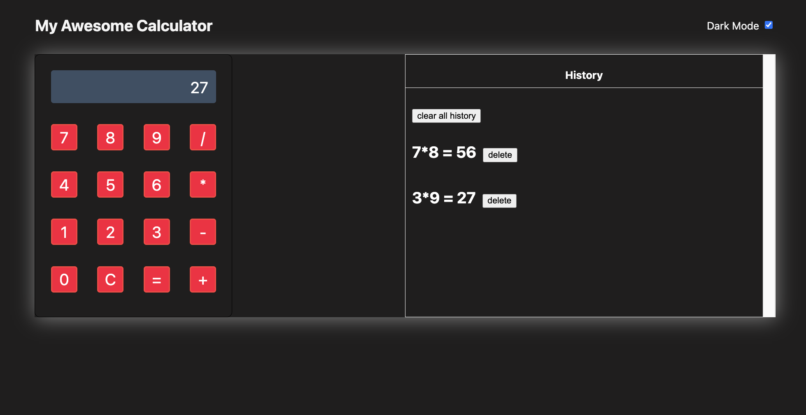
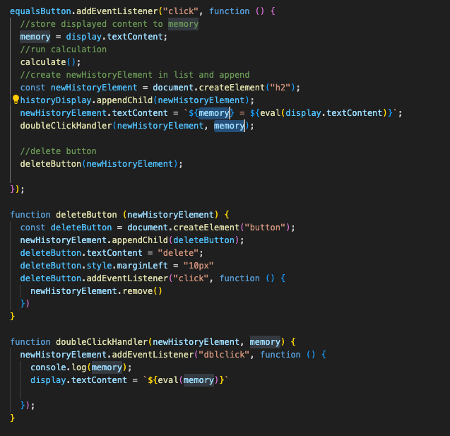
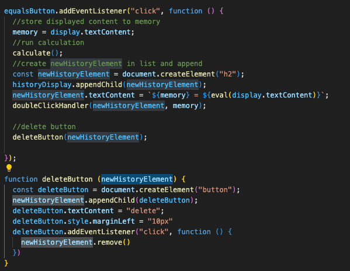

# Calculator (Basic Replica)

---

# Intro

This mini-project was completed late Feb 2024 as part of General Assembly's Bootcamp, at the start of Week 3 in our course. The CSS section was pre-built out for us, and the focus of this project was using our knowledge of DOM manipulation and JavaScript.

---

# Design

It was designed based on hypothetical user styles.
User wanted to be able to:

- Conduct calculations and see the output of the mathematical operation.
- Clear all operations and start from 0.
- See previous history of actions as a history
- Delete a single history, and clear all history
- Switch between dark and light mode

The bonus was to give users the ability to double click on a history and have that result to show up in the calculator's history.



---

# Functionality

## DOM Variables

I started by defining the variables on Javscript to reference the display (section of the calculator where results of operation display), the number/operation buttons, the equal button, the clear button, and the history-display section on the side.

## Calculation

The number and operation buttons each have event listeners and when clicked on, their `textContent` displays on the calculator's display screen. The `this.text Content` retrieves the text content of the last clicked button and adds it to the display's `textContent`- essentially concatenating the text content of what's being clicked on in the calculator to show in the display. Written out it says `display.textContent = display.textContent + this.textContent;`

The equal button also has an event listener and when it's clicked, what's on the display is stored to a local variable called `memory`
`eval()` is then used to calculate what's on the display screen.

## History Log

The variable `memory` is then used to reflect what was typed in the display along with the result in the history log.

```
newHistoryElement.textContent = `${memory} = ${eval(display.textContent)}`;
```

To allow for users to double click on an item in the history log, and have that item's calculated result show on the calculator screen, the variable `memory` is used again. An event listener is added so that when a line on the history log is double clicked, then it will pull its respective `memory` variable, and executes `eval()` on it to calculate the result which is displayed on the calculator screen.

## Clear Display

An event listener is added to the clear button and it will change the calculator's display.`textContent = ""` or blank.

To delete or clear the history log elements, each time the equal button is clicked- in addition to calculating and creating a new history log element (which can then be double clicked on to display results on the calculator screen), the last function attached to that event is the `deleteButton()`. This function creates a delete button next to each history log line, and once that button is clicked, the the new history element is removed.

Disclaimer: We recognize that removing and creating elements in the DOM can systemtatically be expensive due excessive redraws. While this "remove and create" was requested as part of hypothetical user stories, this would be a feature that I would improve upon if another version were to be created.

## Dark Mode

With dark mode, an event listener is added to the checkbox, and that will add the background of black to the body as well as change the font to white. This is done by toggling a classlist.



---
# What I Learned

## Storing Value to Variable

The screenshot below shows how we create a variable called memory which is equal to what is shown in the display of the calculator, i.e. 6 + 5. This memory variable is then used to log the history of our calculations with `${memory} = ${eval(display.textContent)}`
In other words, each time a new history element is created, it captures the value of memory at that specific moment. When a history element is double-clicked, it will use the memory value associated with that particular history element, not the global memory variable.



## Passing Along Parameters

When writing functions, it's important to see if any variables that the function needs to access are local. If so, then we want to pass them along as paramters. Otherwise, the local variables would only be scoped to that function. To provide access to local variables, we have to explicitly pass those variables as paramaters.

To explain it a bit further, in this example screenshot below, `newHistoryElement` is local to the equalButton event listener function.  
We reference the `deleteButton` function in the `equalButton` event listener function. The `deleteButton` function is then defined seperately outside, so we have to pass the local newHistoryElement variable along in the parenthesis in both instances as a parameter.


